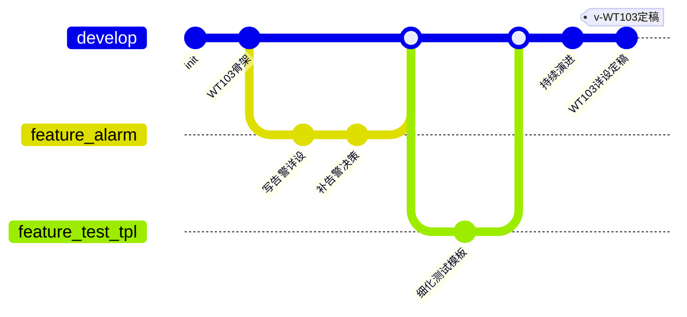
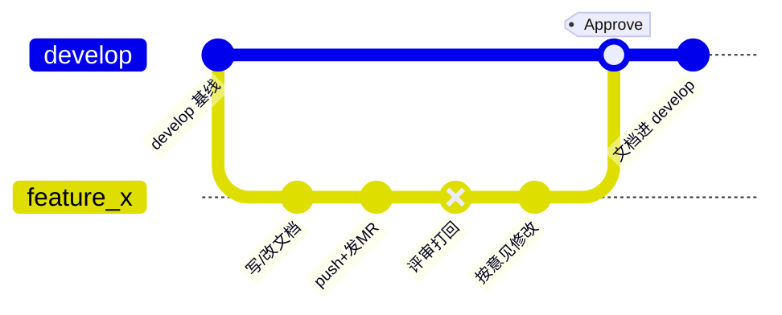
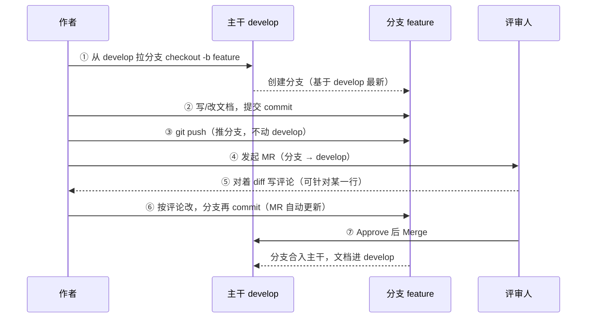

# Git 版本迭代规范

> 团队知识库仓库（team-kb）版本迭代与分支管理唯一标准。
> 关联：[[团队知识库方案设计]] §8

---

## 1. 设计理念

知识库不是生产代码，**没有"线上发布 / 版本回滚 / 紧急修复"的硬性概念**。
核心诉求是：演进可追溯、改动可评审、权威源唯一、避免直接污染主干。

因此采用**轻量分支模型**——以 `develop` 为权威源，改动走 `feature` 分支 + Merge Request；
代码仓库的 `release` / `hotfix` / `odm` 等重型流程**不强制**，仅在确有需要时可选启用。

## 2. 分支模型

| 分支 | 角色 | 说明 |
|------|------|------|
| `develop` | **权威源（唯一长期分支）** | 知识的当前真相，所有人以此为准。受保护，禁止直接 push |
| `feature/<主题>` | 临时工作分支 | 一次知识更新开一个，合并后删除。分支名用英文，如 `feature/alarm`、`feature/test_tpl` |
| `release/<版本>` | 里程碑快照（可选，不强制） | 仅在需要冻结某次重大定稿时使用 |

## 3. 核心原则

1. **权威源唯一**：`develop` 是知识库的 single source of truth，任何文档的"当前版本"以 develop 上的为准。
2. **改动走 feature + MR**：禁止直接改 develop。新建 `feature/alarm`（温度告警详设）、`feature/test_tpl`（补测试模板）等，通过 Merge Request 合入。分支名用英文（中文会导致 Mermaid 等工具解析失败）。
3. **MR 即评审留痕**：评审意见、讨论、变更原因留在 MR 描述区和评论里，形成决策追溯链。
4. **commit 语义化**：用类型前缀 `feat / fix / docs / refactor` + 简述，与代码仓库 commit 规范对齐，便于检索。
5. **一主题一分支**：一个 feature 分支只做一件相关的事，合并后即删，保持分支列表干净。

## 4. 里程碑标记（tag / release，可选）

知识库持续演进，**默认无需版本快照**。
但遇到重大里程碑（如"WT103 详设全量定稿""年度知识库归档"）时，**可选**：

- 打轻量 tag：`git tag v-WT103-详设定稿`，标记某个时间点的知识快照
- 或建 `release/<版本>` 分支：冻结该版本，后续 develop 继续演进互不影响

以上均非强制，由维护者按需决定。

## 5. 分支演进图

## 6. MR 评审流程

所有改动从 `develop` 拉 feature 分支，评审通过后合回 `develop`，主干不被直接改动。
commit 节点标注对应动作，`type: REVERSE` 节点表示评审打回，merge 节点表示 Approve 合入。

> 节点说明：正常 commit = 作者提交；`type: REVERSE` 节点（带叉号标记）= 评审被拒（Reject / Request changes）打回；merge 节点 = Approve 后合入主干。多轮拒绝则重复"打回 → 修改"直到通过。（节点颜色随渲染主题变化，以叉号标记为准，不依赖颜色）

角色交互（作者 ↔ 分支 ↔ 主干 ↔ 评审）：

## 7. 评审留痕（相对飞书的核心优势）

MR 的每一条评论、每次回复、谁在什么时间提的、对应哪个 commit 的哪一行、作者怎么改的、谁 Approve 的，全部永久留痕，钉死在版本历史上。事后能完整复盘"这个决策当时为什么这么定"。

对比飞书：飞书评论改完可能就飘、版本对不上；Git MR 是"评论 + 变更 + 审批"三者绑定版本历史。这正命中知识库"可控、可追溯"的核心诉求。

## 8. AI 辅助评审与交互短板

GitLab 网页对着 diff 逐行写评论，对工程师尚可，对不熟 git 的人存在交互门槛（切网页、找行、读 diff 格式）。这是客观短板。对策：

### 8.1 AI 辅助评审（主推，分两段）

后续接入 GitLab 的 AI 辅助评审工具，评审分两段串行：

1. **AI 评审（第一道）**：AI 经 MCP / GitLab 工具读 MR diff，自动给出评审意见（甚至按意见预改），覆盖格式、双链有效性、frontmatter 完整性、明显事实错误等。
2. **人工评审（第二道）**：**AI 评审通过后**才转人工，人聚焦技术准确性与架构决策，做最终 Approve。

即"AI 先过一遍 → 人再过一遍"，把"对着 diff 找行"的烂交互让 AI 兜底，人只做高价值判断。

### 8.2 轻量评审

知识库非生产代码，不强制逐行评论；可整篇评论 + 对话讨论，记 MR 描述区或 commit message。一样留痕，门槛低。

### 8.3 本地工具替代

VS Code 的 GitLab MR 插件 / Obsidian 看 diff，比网页顺，适合熟 IDE 的人。
