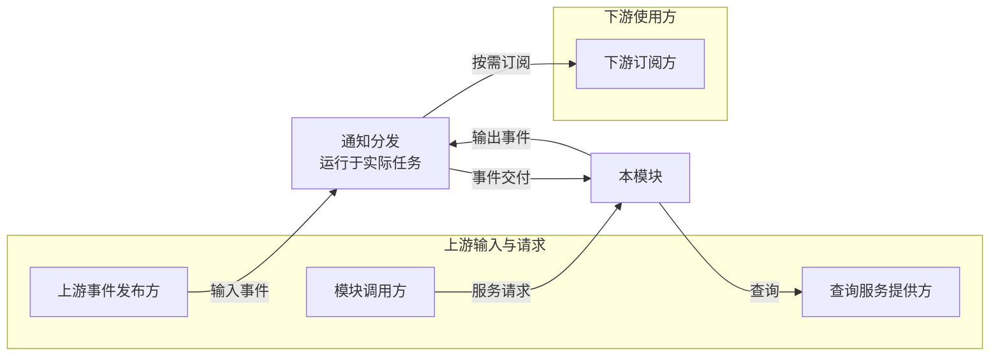
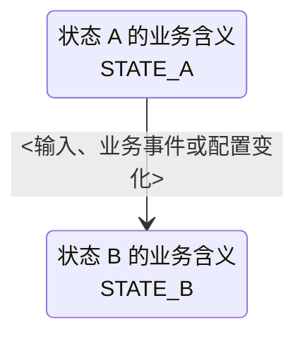
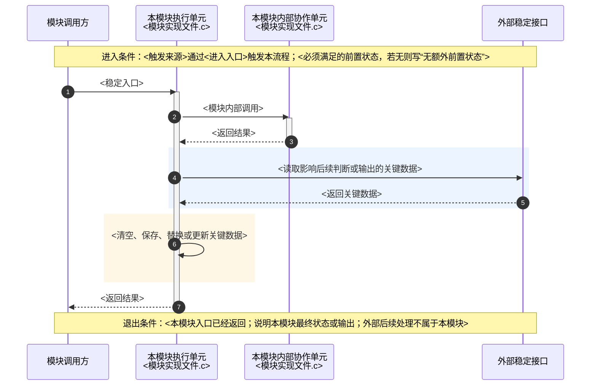

# <模块/功能名>详设

> 模板：嵌入式单片机模块/功能详细设计。复制后修改使用。
> 详设是设计权威源；设计变化应先更新详设，再修改代码。

使用说明：

- 原则上每个职责独立的功能模块建立一份详设；多个源码文件共同实现同一模块时可合并为一份，不按文件数量拆分。
- “模块组成”只列职责属于本模块的目标源文件和头文件。调用方、通知分发、参数管理、协议解析、板级驱动及下游模块即使参与同一调用链，也不得列入本模块文件组成。
- 本详设对应的模块由文档标题、模块概述和职责边界明确，不为本模块额外创建指向自身的双链。
- 与其他模块存在关系时，若知识库已有该模块的详设或模块说明，则使用双链指向实际文档；没有可链接文档时使用普通文本，不创建无落点的空链接。
- `source`、`git_branch`、`git_commit` 用于锁定详设对应的源码版本；非源码类详设可删除这三个字段。
- 正文描述稳定的设计接口与约束，不记录容易失效的源码行号；必要时可写对外函数、事件或回调名称。
- 正文只描述目标设计。源码现状、实现差异、改造清单和实施步骤应写入独立核对文档，不进入正式详设。
- 文中的 C 标识符、函数原型、枚举、宏及代码示例必须符合当前项目的 C 编码规范；类型、函数和变量使用项目约定命名，枚举成员与宏使用大写下划线命名。
- §2.1 接口概览分为 §2.1.1“函数”和 §2.1.2“事件”两个子章节，不使用“接口/事件”混合表。函数表使用“函数、调用方、接收方、用途”列；事件表使用“事件、方向、发布方、接收方、用途”列。
- 流程、规则和异常处理应使用可直接理解的动作描述；必须使用专业术语时应就地解释，不使用“饱和”等未定义术语代替具体行为。
- 正文使用短句和分点，按 [[知识库规范/文件大小规范#2.1 详设正文的文字长度与分行|文字长度与分行规则]] 校验。
- 纯文字单行超过 120 个可见字符或连续段落超过 200 个时，先去除重复内容，再用 `- ` 小圆点列表逐项分行；每项不超过 120 个可见字符。
- 列表前留空行，每项一个要点；源码换行不代替分项，不通过空行切段规避超限。保留条件、动作、时机、异常和结果，不拆断标识符。
- 字数口径与排除范围以关联规则为准；相邻图表不豁免长文字，图表已表达的内容不重复复述。
- 写入前后运行固件详设技能中的 `scripts/validate_detailed_design_prose.py <详设路径>`；按当前环境定位技能目录，不把本机绝对路径复制进正式详设。
- 文字校验只检查长度，不能代替语义去重和约束完整性复核；局部修改修正本次涉及的说明块，全篇修订修正全文，历史超限单独报告。
- “模块概述与职责边界”只保留对应需求范围、依赖关系和职责边界，不单设“设计目标”。工程结果和关键约束应写入对应的接口、逻辑、时序或配置章节，不在概述中重复汇总。
- “模块组成”作为“模块概述与职责边界”下的 1.4 小节，紧随职责边界列出本模块直接维护的目标文件，不设置独立章节，也不设置“正常处理流程”。接口入口的处理分支写入对应函数说明，跨参与者的调用顺序写入时序章节。
- 每张时序图必须在全部参与者声明之后、第一个调用箭头之前使用 `Note` 明确写出触发来源、进入入口和前置状态；没有额外前置状态时明确写出，拆分后的每个子图分别标注。
- 时序图必须标明执行上下文和本模块入口、返回边界。先用 `break` 表达处理后立即退出的失败分支，只保留会继续执行或汇合的真实业务分支；完成早退简化后，`alt/opt` 嵌套达到三层及以上才拆图，两层以内保留在原图。
- 时序图普通文本每行不超过 20 个汉字等效宽度；`Note` 的单行上限按其实际跨越的生命线数量等比例放宽。使用 `<br/>` 在语义边界换行，不拆分函数名、事件名或字段名。
- 第 3 章专门描述业务状态迁移；没有独立业务状态机时明确说明，不把配置加载、计算步骤或调用流程写成状态。
- 模块存在配置功能时，必须在 §2.2“关键数据结构”中定义模块实际消费的完整配置结构体，并说明字段、默认值、实际保存对象、访问约束和外部配置映射；只有责任跨模块或可能混淆时才说明维护责任。第 5 章配置参数表不能代替配置结构体定义。
- HTML 注释中的“门磁检测”内容是填写示例，正式成文时替换或删除。
- 协议映射、硬件约束、持久化机制和测试验证分别由独立的协议、硬件、参数管理和测试文档维护，不在功能详设中重复设置章节。函数或事件的失败行为直接写入对应接口契约，跨模块风险写入“风险与待确认”。

**上下游契约边界（编写说明，不复制到正式详设）**：

- 写清本模块接收的上游事件、输入内容及处理规则，以及对外产生的业务事实；按模块职责划分边界，不按函数所在文件或任务划分。
- 输入定义包含发布方、触发条件、载荷取值、有效期、处理上下文及失败行为；内部转换枚举、处理回调和辅助函数不列为对外接口。
- 通用业务输出使用本模块的事件语义，外部模块按需订阅；接收方列使用“消息订阅方”等职责名称，不预设固定消费者。
- 消费者的上报、设备同步、组包和重试流程由其自身详设定义；本模块只约定消息发布时机、顺序、载荷访问和投递失败处理。
- 事件概览只列事件名、方向、发布方、接收方和用途；载荷值、字段、投递参数及示例放入事件详细定义。
- 职责表和时序图止于稳定接口或消息交付边界；已有必要的直接调用依赖可保留，上报或协议模块也须按自身职责展开，不机械改成广播。
- 修改前后运行固件详设技能的 `scripts/validate_detailed_design_boundaries.py <详设路径>`；仅在需要时用 `--internal-symbol` 或 `--consumer-token` 补充本次检查标识。
- 脚本报告分为 `ERROR` 和 `REVIEW`：前者修正后重跑，后者逐项结合职责判断；脚本只读，不替代消息完整性、语义及图中边界的人工复核。

**内容放置规则（编写说明，不复制到正式详设）**：

| 信息 | 完整定义的位置 | 其他位置怎样引用 |
|---|---|---|
| 字段含义、范围、单位 | §2.2 字段定义及同步的类型注释 | 参数、载荷和配置引用已定义类型；只有本次使用存在额外限制时才补充 |
| 初始值、字段组合、状态与数值的关系 | §2.2 字段约束 | 函数和时序只写采用哪项规则，不重复完整条件 |
| 实际数据的维护责任（需要区分时）、保存方式、读写和保护 | 对应结构体的实例与访问 | 函数说明“内部已保护”并引用规则；不重复罗列全部访问方 |
| 函数参数、返回值、调用限制、处理分支 | §2.3 函数定义 | 概览只写用途；时序图展示调用和关键动作 |
| 事件触发、发布与接收、载荷传递及可访问边界、失败和重复处理 | §2.4 事件定义 | 结构体只定义载荷数据；状态表和时序引用事件规则 |
| 跨参与者的调用顺序、更新与通知的先后关系 | §4 时序图 | 不在结构体中复述流程 |
| 风险触发条件、影响与规避措施 | 风险清单 | 接口和图保留必要的失败行为，不在图旁重复列出风险说明 |
| 模块间依赖 | §1.2 依赖关系图 | 不在图后汇总已由函数、事件和数据定义说明的契约 |
| 多份数据之间的并发关系、锁的使用顺序和临界区内禁止操作 | 对应结构体的实例与访问、函数调用约束或事件回调 | 在实际访问入口说明保护范围，不另设汇总章节 |

**全文格式校验（编写说明，不复制到正式详设）**：

修改前后运行固件详设技能的 `scripts/validate_detailed_design_format.py <详设路径> --template <当前模板路径>`，扫描全部章节。修正格式错误并复核候选项；分别报告全文机械格式、Frontmatter、语义复核和图的实际渲染结果，不能用局部检查代替全文符合性。

**结构体注释校验（编写说明，不复制到正式详设）**：

修改前后运行固件详设技能的 `scripts/validate_detailed_design_struct_comments.py <详设路径>`，可加 `--json` 或传多个文件。修正缺失注释；对表格“含义”“具体内容”覆盖差异逐项复核，不用文字匹配代替语义一致性判断。

**内容归属与重复校验（编写说明，不复制到正式详设）**：

- 按章节用途确定归属，不依赖编号或强制补建章节。表后分支合入处理表，图旁步骤放入图中，风险集中到风险表，不另写重复汇总段落。
- 修改前后运行固件详设技能的 `scripts/validate_detailed_design_content.py <详设路径>`；可用 `--before <修改前副本>` 辅助检查删除、改写或移动后的信息覆盖。
- 脚本只给候选；AI 比较两处的对象、条件、动作、时机、结果及失败行为，不能按关键词或相似度直接删除。
- 删除前指出必要信息的保留位置；独有条件先合并，冲突单独核对。核对记录留在校验报告，不添加到正式详设。
- 概览用途、图中必要动作、风险触发条件及不同接口各自的异常行为允许必要重复；图例和独有补充不因紧邻图表就违规。
- 修改后核对条件、时序、数值、否定及失败行为，分别报告脚本候选与 AI 复核结论；不能把未命中解释为全文无重复。

---

## 1. 模块概述与职责边界

<!--
说明本模块承接的需求范围、在系统中的位置，以及由本模块承担的职责。
产品范围与非目标由需求文档维护，本节只界定模块间的责任归属。
-->

### 1.1 对应需求范围

| 需求来源 | 对应需求功能 | 本详设覆盖的内容 |
|----------|--------------|------------------|
| [[需求文档]] | [[需求文档#需求功能名称\|需求功能名称]] | <本模块承接的需求范围> |

<!--
大需求可以拆分为多份模块详设。本表只说明当前详设承接其中哪一部分，不复制整份需求。
需求功能使用 Obsidian 标题链接；标题含章节序号时使用显示别名，只显示功能名称，避免详设依赖章节编号。
示例：| [[门磁功能需求]] | [[门磁功能需求#门磁状态检测\|门磁状态检测]] | GPIO 采样、消抖、状态判定与状态变化通知 |
-->

### 1.2 依赖关系



<!--
本图是全文唯一的依赖关系图。固定分出“上游输入与请求”、本模块和“下游使用方”；本模块可按实际拆为仅包含本模块运行时组件的 subgraph。
上游事件经实际存在的通知分发交付给本模块；同步服务请求从调用方指向本模块；查询从本模块指向服务提供方；输出事件止于下游订阅边界。没有稳定关系的节点删除，不虚构通知分发或调用方。
边标签先写业务意图；需要对应代码时换行显示真实名称，并用引号保护函数括号。所有图按 [[知识库规范/图表规范#5. 校验规则|图表标签校验规则]] 执行 F013 检查及语义复核。函数原型、参数和返回值写入接口定义；消费者的后续消费、上报、组包、同步和重试由消费者详设说明。
-->

### 1.3 职责边界

| 职责 | 责任模块 | 说明 |
|------|----------|------|
| <本模块职责> | 本模块 | <边界说明> |
| <其他模块职责> | [[其他模块详设]] | <边界说明> |

<!-- 示例：本模块职责写“本模块”，不建立自链接；其他模块可链接到已经存在的模块详设。 -->

### 1.4 模块组成

| 文件 | 职责 |
|------|------|
| `<模块头文件.h>` | <本模块对外类型、宏和函数声明> |
| `<模块实现文件.c>` | <本模块承担的运行逻辑> |

<!--
只列由本模块直接维护、且职责落在 1.3 边界内的文件。文件归属以职责边界为准，不以“被调用”或“参与同一业务链路”为准。
目标设计需要新增或调整文件时填写已确认的目标文件名；未确认的文件名不得自行编造。
-->

---

## 2. 对外接口与数据结构

<!--
只记录供其他模块稳定使用的函数、事件、回调和共享数据，不要求源码行号。
内部辅助函数和临时实现细节不必罗列。
通用通知分发、队列发送、协议解析和参数块读写属于依赖，不列为本模块对外接口。
所有名称使用当前项目已有术语或已确认的目标设计名称，不自行创造模块、任务或协调角色。
函数标识符作为接口名称、小节标题、表格项或正文引用时统一写成 function_name()；函数原型保留真实参数列表。函数指针字段、回调类型、宏、事件、变量、文件名和类型名不追加括号。
-->

### 2.1 接口概览

#### 2.1.1 函数

| 函数 | 调用方 | 接收方 | 用途 |
|------|--------|--------|------|
| <函数名>() | <本模块或 `[[其他模块详设]]`> | <本模块或 `[[其他模块详设]]`> | <一句话说明> |

<!-- 示例：| door_state_get() | [[控制模块详设]] | 本模块 | 获取当前稳定的门磁状态 | -->

#### 2.1.2 事件

| 事件 | 方向 | 发布方 | 接收方 | 用途 |
|------|------|--------|--------|------|
| <事件或回调名称> | <输入/输出> | <本模块或 `[[其他模块详设]]`> | <本模块或 `[[其他模块详设]]`> | <一句话说明> |

<!-- 事件包含通知和回调；方向按当前模块接收或发出填写。 -->

### 2.2 关键数据结构

<!--
每个枚举和结构体单独使用一个四级小节，定义前使用分隔线。不得因为复用同一基础类型或出现在同一代码块中，就把多个职责不同的类型合并说明。
枚举统一使用“用途 → 类型定义 → 枚举值定义 → 枚举值规则”；结构体统一使用“用途 → 类型定义 → 字段定义 → 字段约束 → 实例与访问”。用途、类型定义和字段定义必须完整；字段约束或实例与访问没有独立信息时可以省略，保留部分的顺序不变，不填空标题或“无特殊要求”等占位句。
结构体定义前增加用途注释，每个成员增加就近的 C 注释；将字段表“含义”和“具体内容”（存在时）完整补入对应注释，保留其中的单位、范围、特殊值、条件和限制。“同上”等依赖表格位置的表述须展开；表格保留，注释与表格同步维护，属于必要重复。
字段定义表中每个声明字段单独一行，不得用“多个标志”“若干计数器”或合并字段名代替逐字段说明。普通结构体使用“字段、类型、范围/枚举、单位、含义”；运行配置结构体增加“默认值、来源”；函数指针结构体改用“字段、类型、是否必须、参数/返回值范围与定义、含义”。
枚举表只写数值、含义和具体使用限制，不填“合法配置值”“合法检测方向”“合法未知态”等空泛描述。全表没有独立限制时省略“取值限制”列；部分值没有额外限制时填“—”。枚举值规则仅补充表中未覆盖的使用范围、哨兵/未知值处理和必要转换，没有独立内容时省略；初始化、通知时机及接口转换在对应章节定义，不重复解释或记录讨论过程。内容校验脚本的 D005、D006 分别检查空泛措辞及无实际约束列。
结构体“字段约束”只说明初始值、字段取值之间的关系、合法组合，以及状态变化后哪些成员值必须保持或改变。用“条件成立时，字段取何值/哪些字段同时改变”的完整短句；字段表已说明的单字段范围和含义不再重复。内存保存、复制、指针有效期和并发保护写入“实例与访问”或具体函数/事件的传入契约；不在字段约束中展开接口调用、消息处理步骤、其他模块职责或未声明的参数。
同一结构体在不同函数或事件中表示不同业务数据、且自身不携带区分字段时，优先使用一条完整句子说明：先写结构体未保存的业务标识，再依次写明各函数参数或事件对应的字段含义和单位。代码标识符使用行内代码，不同使用场景使用分号分隔；只有单句过长或映射关系复杂时才拆成子列表，不机械增加“**不包含**”“**判定方式**”等标签。
“关键数据结构”只展开本模块定义的类型，以及由本模块负责维护的跨模块稳定契约。外部模块定义的枚举或结构体不得出现在本节：不复制类型、字段、枚举、尺寸、所有权或生命周期，也不单设“外部输入”小节；只在本模块实际使用该类型的函数参数、事件载荷或运行逻辑处链接定义方详设。只有本模块是跨模块稳定契约的明确所有者时，才在本详设定义该契约。
定义顺序优先按类型依赖和职责排列：基础枚举与通用数据、输入契约、输出契约、运行配置、内部记录与模块总体。不按源码中偶然的定义位置或字段复用关系分组。
模块存在配置功能时，本节必须包含模块实际消费的完整配置结构体定义；结构体使用嵌套类型时，同时定义或链接对应稳定类型。配置结构体说明全部字段、默认值、实际保存对象和访问规则；配置读取、校验、生效和失败过程写入对应函数或事件。外部持久化结构与模块运行配置不同时，在字段来源中给出映射。没有配置功能时无需虚构配置结构体。
-->

---

#### `<枚举名称>`

**用途**：<该枚举表示的业务维度，以及用于哪些字段、接口或状态判断>

**类型定义**：

```c
typedef enum {
    <ENUM_VALUE_A> = 0,
    <ENUM_VALUE_B>,
    <ENUM_VALUE_MAX>
} <enum_type_t>;
```

**枚举值定义**：

| 枚举值 | 数值 | 含义 | 取值限制 |
|----------|-----:|------|----------|
| `<ENUM_VALUE_A>` | 0 | <确切业务含义> | <具体使用条件；无额外限制填“—”> |
| `<ENUM_VALUE_MAX>` | <实际数值> | <数量或上限含义> | <例如：仅用于数组边界，不接收、不发布> |

**枚举值规则**：

- <哪些枚举值可用于输入、输出、数组下标或状态保存>
- <哨兵值、上限值和未知值的拒绝、转换或降级规则>
- <与其他枚举转换时是逐项映射还是可以直接复制>

---

#### `<结构体名称>`

**用途**：<该结构体作为输入载荷、输出快照、运行配置还是内部状态，以及由哪个接口或处理路径使用>

**类型定义**：

```c
/* <结构体用途及承载的业务数据> */
typedef struct {
    <field_type_t> field; /* <字段业务含义、边界和失效表达>；<字段表具体内容，存在时填写> */
} <struct_type_t>;
```

**字段定义**：

| 字段 | 类型 | 范围/枚举 | 单位 | 含义 |
|------|------|-----------|------|------|
| `field` | `<field_type_t>` | <合法范围或枚举值> | <单位/无> | <字段业务含义、边界和失效表达> |

<!--
运行配置结构体将字段表替换为：
| 字段 | 类型 | 范围/枚举 | 单位 | 默认值 | 来源 | 含义 |
|------|------|-----------|------|--------|------|------|
| `field` | `<field_type_t>` | <合法范围或枚举值> | <单位/无> | <默认值> | <配置字段或构造来源> | <字段业务含义> |

函数指针结构体将字段表替换为：
| 字段 | 类型 | 是否必须 | 参数/返回值范围与定义 | 含义 |
|------|------|----------|-----------------------|------|
| `callback` | `<function_pointer_type>` | <必须/可选；是否允许为 NULL> | <参数方向、空值约束、生命周期、范围、单位、返回值和失败时输出是否有效> | <注入的板级或外部能力> |
-->

**字段约束**：

- <条件成立时，哪些字段取何值、同时变化或保持不变>
- <字段之间的合法组合；不重复字段表，不写内存和调用流程>

**实例与访问**：

- **保存方式**：<实际承载对象，以及初始化、覆盖或释放的具体条件>
- **写入**：<写入方；有并发区分时补充任务/中断及允许修改的成员>
- **读取**：<读取方或查询接口；区分读取原数据与读取副本>
- **访问规则**：<需要遵守的整体复制、指针使用边界或并发保护；仅填写实际存在的约束>

<!--
实例与访问填写细则：
1. 先确认说明对象是模块内部记录、调用方缓冲区、发送方原消息还是队列副本。同一类型不等于同一份数据；规则确实不同时，用“**实例：<对象用途>**”分别说明，不共用一条归属或生命周期结论。设计上每份数据只由一个模块维护；需要区分责任时才写出该模块，副本持有方不是原对象的共同所有者。
2. 默认使用“保存方式 → 写入 → 读取 → 访问规则”的顺序，以短句列表逐项分行，不使用六列横表，不给查询接口套“发送方/接收方”。一个角色一句话；多个角色访问不同成员时，在同一标签下分行说明，不拼接成流程段落。
3. 标签按条件保留：只有多个模块或对象都可能维护同一数据、需要消除责任歧义时，才在“保存方式”前增加“**维护责任**”说明；单一模块详设中的内部记录不写“本模块”或模块名称。存储方式或使用边界影响调用时写保存方式；确有写入、读取时填写对应项；存在复制、指针引用或并发要求时写访问规则。上下文已唯一说明、没有新增信息的项直接省略，不用“无”“不适用”占位，也不为凑齐读写双方而虚构角色。
4. 保存方式必须写具体行为。静态记录说明由哪个初始化入口设置初值、后续怎样覆盖、复位后怎样初始化；不要把初始化函数误写成静态内存的分配方。局部对象说明在哪次函数调用中使用、返回后是否仍被引用；动态对象说明申请和释放责任及触发条件；调用方缓冲区说明谁提供、在哪次调用返回前必须保持有效。只填写已确认的设计，不推测底层分配或释放接口。
5. 原消息、队列副本、查询副本和模块内部记录分别说明可访问边界。具体消息在何时复制、回调返回后能否保留地址，以及查询函数是否保留参数地址，由对应事件或函数定义；结构体只保留必要的读写关系或准确链接。不把“系统运行期”“运行期”“单次发布”“长期有效”单独作为生命周期说明。存储是否存在与数值是否可用于业务判断必须分开，后者由字段状态及字段约束定义。
6. 字段约束回答“字段必须是什么关系”，访问规则回答“访问这一份数据应遵守什么条件”。更新整份数据的临界区、锁和指针边界只在访问规则定义；具体输入校验、选源、回调顺序、发送失败等处理留在函数/事件，不写入本节。
7. 有共享访问时明确实际访问方、保护对象和机制；需要整体更新或复制时写出成员范围。同一上下文串行访问时，只有需要解释并发判断才写明该上下文及无需加锁的理由。不只写“线程安全”“单写者”或“已保护”。
8. 仅作组合成员、没有自身独立访问规则的类型，只写“作为 <外层类型.成员> 使用，访问规则见 <外层类型>”，不编造独立所有者。有独立访问规则的成员记录可以在其类型小节说明；外层总体结构只补充其余成员或跨成员规则，不重复内层说明。静态分配和初始化规则由实际承载结构定义，成员类型链接引用。
9. 字段/实例的完整规则各保留一处；函数可以写“内部已保护”并引用，时序图保留必要动作。不得把这些编写细则、标签选择理由或省略理由写进正式详设。
-->

---

### 2.3 函数接口详细定义（按接口重复）

<!-- 每个函数定义前使用分隔线，复制接口时应同时复制分隔线。参数表引用已有结构体定义，只补充参数方向、空值、缓冲区可访问边界和本接口专有限制；处理分支及失败返回在本节完整定义。 -->

---

#### `<函数名>()`

**用途**：<该函数完成什么操作，调用后得到什么结果>

**函数原型**：

```c
<返回类型> <函数名>(<参数列表>);
```

**参数定义**：

| 参数 | 方向 | 类型 | 范围/枚举 | 单位 | 说明 |
|------|------|------|-----------|------|------|
| <参数名> | <输入/输出/输入输出> | <类型> | <范围或枚举值> | <单位/无> | <语义及边界条件> |

**返回值定义**：

| 返回值 | 含义 | 调用方处理要求 |
|--------|------|----------------|
| <返回值或枚举> | <成功、失败或状态含义> | <重试、降级或忽略等> |

**调用约束**：

| 调用时机 | 运行位置 | 阻塞性 | 可重入 | 并发保护 | 副作用 |
|----------|----------|--------|--------|----------|--------|
| <调用条件> | <主循环/任务/中断等> | <阻塞/非阻塞> | <是/否> | <接口内部临界区/互斥锁/原子访问/无需保护> | <状态修改、持久化、硬件动作或无> |

**异常处理**：<未初始化、参数非法、资源忙或底层失败时的行为>

<!--
示例：door_state_t door_state_get(void);
无输入参数；返回 DOOR_STATE_OPEN、DOOR_STATE_CLOSED 或 DOOR_STATE_UNKNOWN；可在主循环和任务中调用；非阻塞、可重入、无副作用；未初始化时返回 DOOR_STATE_UNKNOWN。
查询复合输出时，接口在模块内部完成临界区保护并一次返回完整快照。模块内部写入使用同一保护。调用方不操作模块私有锁。
接口包含复杂算法或处理分支时，在本接口详细定义中追加“处理规则”，必要时使用 flowchart；不要另建“正常处理流程”章节。
-->

---

### 2.4 事件与回调详细定义（按事件重复）

<!--
每个事件或回调定义前使用分隔线。
同一文档的输入、输出事件及回调按下列五项组织；外部订阅可用“订阅示例”替代“注册/传入方式”。补充内容依次使用“载荷访问规则”和“处理规则”，不另起同义标题或混写为无标题列表。零载荷省略访问规则，无额外处理规则时省略对应块，不保留空表。
接口概览只列跨模块稳定契约。为说明 ISR、任务、定时器或配置切换而必须定义的内部事件，可以仅在本小节说明，并明确其内部用途，不列入接口概览。
载荷使用 §2.2 已定义的结构体时，直接链接该类型，不再复制完整字段表。事件专用限制在本节补充；明确原消息与副本的复制时点、接收方允许访问载荷的起止条件，以及是否允许保留载荷地址。订阅何时生效/注销与载荷能访问到何时是两件事，分别说明。
-->

---

#### `<事件或回调名称>`

**用途**：<该事件表达什么状态变化或业务事实>

**事件/回调原型**：

```c
<事件定义，或 typedef void (*<回调类型>)(<参数列表>);>
```

<!-- 没有 C 原型时，写明事件名称和载荷结构。 -->

**注册/传入方式**：

<!--
按实际接入方式选择一种写法，不同时保留等价示例和说明表：
- 外部模块调用已有注册接口时，本块改为“订阅示例”，用简短 C 代码展示事件标识、回调签名、注册调用和失败处理，不用长段文字复述用法。
- 注册参数及返回语义须核对实际接口；示意的订阅方回调和日志宏就地注明，不新增包装接口，不绑定具体消费者或展开其业务流程。
- 必要注册时机用短注释说明；历史消息补发、注销和载荷有效期等必要契约用短句或引用补充，不重复其他位置的定义。
- 配置字段注入或静态绑定等不适合注册示例的场景，按需使用下面的表格；无注册或传入动作时明确说明，无需凑示例。
-->

| 方式 | 接口/配置字段 | 注册或传入时机 | 空值/重复注册规则 | 生命周期 |
|------|---------------|----------------|-------------------|----------|
| <初始化参数/静态绑定等> | <接口或字段> | <初始化/运行期> | <是否允许 NULL、是否允许覆盖> | <保持到何时失效> |

**载荷定义**：

| 字段 | 类型 | 范围/枚举 | 单位 | 说明 |
|------|------|-----------|------|------|
| <字段名> | <类型> | <范围或枚举值> | <单位/无> | <字段语义> |

**发布与接收约束**：

| 触发条件 | 发布方 | 接收方 | 传递方式 | 运行位置 | 丢失/失败处理 |
|----------|--------|--------|----------|----------|---------------|
| <条件> | <本模块或 `[[其他模块详设]]`> | <本模块或 `[[其他模块详设]]`> | <同步回调/消息队列/事件标志等> | <任务/中断等> | <重试、丢弃、保持状态等> |

<!--
示例：door_state_changed(old_state, new_state)；稳定状态发生变化时由门磁检测模块发布，控制模块通过同步回调接收；载荷包含变化前后的 door_state_t；初始化首次确认状态时不发布。
发布次数与顺序在“发布与接收约束”中说明，不放入载荷定义。
-->

**载荷访问规则**：

- <原消息有效期限、复制时点>
- <接收方访问起止条件、是否允许保留地址、需留存时的复制要求>

**处理规则**：

<共用前提；没有时删除本行>

| 条件 | 处理结果 |
|------|----------|
| <校验、状态变化、重复输入或控制使用条件> | <接受、拒绝、更新、忽略或数值使用限制> |

<!-- 处理分支统一使用“条件 / 处理结果”表；已有规则以引用代替重复，具体执行顺序留在时序章节。 -->

---

## 3. 状态迁移

<!-- 只有两个业务状态时直接使用下方迁移表，删除状态图；多状态模块使用状态图，表格仅补充图中难以清晰表达的规则。 -->



<!-- 表中列出迁移条件和动作；异常处理已在接口中定义时引用对应小节，避免重复。选择状态图且图已完整表达时删除下表，不保留空表。 -->

| 当前状态 | 事件/条件 | 下一状态 | 动作 | 异常路径 |
|----------|-----------|----------|------|----------|
| <状态> | <事件或条件> | <状态> | <进入/退出动作> | <超时或失败行为> |

<!--
示例：| CLOSED | 连续 3 次采样为高电平 | OPEN | 发布开门事件 | GPIO 异常时保持原状态并记录异常 |
状态机节点只描述业务状态。所有业务状态流转都应完整展示，包括配置修改、启用、禁用或配置非法触发的状态变化；配置加载、缓存重建和重新计算等处理步骤放入对应函数说明或配置时序，不作为状态节点。
两个业务状态可仅用迁移表；多状态模块提供 Mermaid stateDiagram-v2，统一前置条件用图中 Note 说明一次。避免图、表与文字重复。设备复位、启动初始化等生命周期过程在对应接口定义，不放入业务状态迁移图或表。
没有独立业务状态机时，删除图表并明确写“本模块无独立业务状态机”。
-->

---

## 4. 时序图

<!--
函数调用时机、运行位置、阻塞性、可重入性、并发保护和副作用统一在 2.3 的“调用约束”中定义；事件和回调的触发及执行上下文在 2.4 中定义，本章不重复建立逐函数“运行方式”或并发汇总目录。
存在模块内部调用顺序或异步事件时，应使用 Mermaid sequenceDiagram。
状态变化在第 3 章使用 stateDiagram-v2；接口内部处理分支写入对应函数说明，跨参与者顺序在本章使用 sequenceDiagram。
-->

**关键读写高亮规则**：浅蓝色表示会影响后续判断或输出的关键数据读取，浅橙色表示清空、保存、替换、更新等关键数据写入。普通调用、返回、校验、纯计算和事件发布不高亮。

### 4.1 模块内运行时序（按链路重复）

<说明本图覆盖 §1.4 中的哪些运行时文件，以及外部参与者止于哪个稳定边界。>



<!--
本模块内部参与者必须能够回溯到 §1.4 的运行时代码文件或已确认内部组件；只提供声明、类型或宏的头文件不作为运行时参与者。
模块外部优先使用“模块调用方”“板级采样接口”“下游接收方”等通用职责名称；需要源码映射时在中文职责之后换行标注实际模块或接口名。跨模块时序止于稳定接口，不展开外部模块的解析、持久化、调度、通知分发或消费流程。
每张时序图必须在全部 `participant` 声明之后、第一个调用箭头之前使用 `Note` 写明“进入条件”，并完整包含触发来源、进入入口和前置状态。没有额外前置状态时写“无额外前置状态”，不得省略；多图拆分时，每个子图分别说明进入条件，承接其他子图时写清承接的结果或状态。
每张时序图在本模块最后一个调用或返回箭头之后使用 `Note` 写明“退出条件”，明确本模块入口是否返回、最终状态或输出以及异常分支的结束位置。图应在本模块稳定边界结束，不展开调用方返回后的任务循环、队列调度或下游内部处理。
存在多个任务、ISR、定时器或回调上下文时，使用 `box` 按真实执行上下文分组；使用 `activate`、`deactivate` 标明本模块函数或回调的实际执行区间。只有一个执行上下文时无需为满足格式机械增加 `box`。
同步调用的下一条箭头应从上一调用的接收方继续，返回后再回到调用方；异步消息使用虚线箭头，并在箭头或相邻 `Note` 中说明入队、唤醒和载荷语义，不得画成发布方直接调用接收任务。通用通知分发不单独虚构为本模块参与者，也不展开外部任务的事件等待和队列遍历过程。
一个 `sequenceDiagram` 只表达一条触发到输出的跨参与者主链。异常、校验失败、资源获取失败或消息投递失败在完成必要的清理、记录或返回后立即终止当前流程时，使用顺序 `break` 表达早退；成功路径直接写在 `break` 之后，不再用外层 `alt` 包裹后续全部步骤。
只有各分支仍会继续执行不同后续流程，或分支处理后需要汇合到共同动作时，才使用 `alt/else` 或 `opt`。完成早退简化后，`alt/opt` 有效嵌套不超过两层时保留为一张图；达到三层及以上时，再按独立触发阶段、跨执行上下文切换或稳定输入/输出边界拆成子图，不得按每个判断机械拆图。拆分后的每个子图必须按前述规则独立标注进入条件和退出条件，并写清承接的结果或状态。
只发生在一个执行单元内部的算法、状态判定和结果映射放入对应函数说明，使用 `flowchart` 或决策表，不为规避时序图嵌套而机械拆成多个时序子图。
图中文字按显示宽度换行：一个汉字按 2 列，英文字母、数字和符号按 1 列。参与者名称、箭头说明及 `alt/else/opt/loop/break` 标题每行不超过 40 列，即 20 个汉字等效宽度；`Note` 每行上限为 40 列乘以实际跨越的生命线数量，跨越数量包含首尾及中间生命线。使用 `<br/>` 在语义边界换行，不得从函数名、事件名或字段名中间断开；单个标识符超过上限时独占一行并保持完整。
每个同步调用使用返回箭头闭合；初始化、参数非法、底层失败和资源忙等适用异常需要在图中判断。
关键读写高亮只覆盖会影响后续判断或输出的数据操作，不按箭头数量机械着色。读取统一使用 `rect rgb(235, 244, 255)`，写入统一使用 `rect rgb(255, 247, 230)`；同一文档不得改变颜色语义。
多条独立链路分别建立 4.x 小节；没有必要绘图时可删除本小节。
-->

### 4.2 外部协作边界（按需）

<说明本模块不负责的配置、调度、持久化、通知分发或下游处理，以及这些外部逻辑如何通过稳定接口与本模块交互。>

<!--
一条流程完全由外部模块实现时，不为补齐链路而画进本模块时序图；使用本小节的边界文字说明，或链接到对应模块详设。
没有需要补充说明的外部协作边界时删除本小节。
-->

---

## 5. 配置参数

| 参数 | 默认值 | 范围/枚举 | 单位 | 变量名 | 生效时机 | 越界处理 |
|------|--------|-----------|------|--------|----------|----------|
| <中文参数名称> | <默认值> | <范围> | <单位> | `<实际变量名>` | <立即/重启后> | <拒绝/钳位/回退> |

<!-- 示例：| 消抖确认次数 | 3 | 1～10 | 次 | `debounce_count` | 启动时 | 越界时使用默认值 3 | -->

<!--
每列只表达一个概念。只有写入生效和业务采用确有时间差时才拆分说明。
需要拆分时，统一使用“配置事务完成时机”和“模块应用时机”，不要混用“理解”“采用”“生效”等列名。
全部参数采用相同规则时，在表外统一说明，不逐行重复。
模块存在配置功能时，本表必须与 §2.2 的配置结构体逐字段一致；本表用于说明参数契约，不能替代配置结构体的 C 类型定义和所有权说明。
-->

## 6. 调试指令与过程日志

### 6.1 调试指令

<!--
每条指令单独填写一次本小节。
格式约定：命令字按原文填写；`<param>` 表示必选参数；`[param]` 表示可选参数。
每条指令定义前使用分隔线。
-->

---

#### `<指令名称>`

**用途**：<指令解决什么问题，供测试、产线还是售后使用>

**发送格式**：

```text
command <required_param> [optional_param]
```

**参数定义**：

| 参数 | 必选/可选 | 类型 | 范围/枚举 | 单位 | 说明 |
|------|-----------|------|-----------|------|------|
| `<required_param>` | 必选 | <类型> | <范围或枚举> | <单位/无> | <参数含义> |
| `[optional_param]` | 可选 | <类型> | <范围或枚举> | <单位/无> | <参数含义及省略时的默认行为> |

**发送示例**：

```text
<完整的实际发送示例>
```

**成功响应**：

```text
<完整成功响应格式>
```

**失败响应**：

```text
<参数错误、状态不允许、执行失败等响应格式>
```

| 通道 | 前置条件/权限 | 副作用 |
|------|---------------|--------|
| <串口/USB CDC/BLE CLI等> | <模式、权限或状态要求> | <状态改变、硬件动作、持久化或无> |

<!--
示例：
发送格式：door simulate <state> [duration_ms]
参数：state 必选，取 open/closed；duration_ms 可选，范围 100～60000 ms，省略时持续到下一条指令。
发送示例：door simulate open 5000
成功响应：OK state=open duration_ms=5000
失败响应：ERR invalid state <state> / ERR duration out of range
前置条件：调试模式；副作用：临时覆盖真实门磁状态，不写入持久化存储。
-->

---

### 6.2 过程日志

<!--
每条必须保留的过程日志单独填写一次本小节。
过程日志覆盖关键状态变化和事件触发时刻，并明确日志位于状态更新、事件入队调用或入队结果之后的哪个位置。
-->

| 关键时刻 | 状态日志 | 事件/操作日志 |
|----------|----------|---------------|
| <初始化、状态变化、配置切换、事件投递等> | <输出/不输出及原因> | <输出/不输出及原因> |

<!-- 简单模块不需要日志时点总览时可删除上表。 -->

---

#### `<日志功能>`

**用途**：<这条日志用于确认什么状态或诊断什么问题>

| 日志级别/宏 | 触发条件 | 屏蔽方式 | 使用场景 |
|-------------|----------|----------|----------|
| <INFO/ERROR/项目日志宏> | <何时输出> | <始终输出/编译宏/模块开关> | <测试/产线/售后> |

**日志格式**：

```text
<与代码一致的完整格式字符串，不包含日志宏名称>
```

**实际输出示例**：

```text
<使用合理示例值展开后的完整日志>\r\n
```

**参数解析**：

| 顺序 | 占位符 | 字段 | 范围/枚举 | 单位 | 含义 |
|------|--------|------|-----------|------|------|
| 1 | `%d` / `%s` / `0x%02X` 等 | <字段名> | <范围或枚举> | <单位/无> | <字段语义> |

<!--
示例：
用途：记录稳定门磁状态变化。
日志级别/宏：DOOR_INFO；触发条件：消抖后稳定状态变化；屏蔽方式：模块日志开关。
日志格式：[DOOR] state changed: %s -> %s
实际输出：[DOOR] state changed: closed -> open\r\n
参数解析：第 1 个 %s 为旧状态，第 2 个 %s 为新状态，取值为 unknown/closed/open。
-->

<!--
本节只记录产品必须长期保留，并提供给测试、产线、售后或上位机使用的调试指令和过程日志。
研发过程中的临时打印、局部变量跟踪、函数进入退出等过程信息不写入详设。
没有需要保留的调试指令或过程日志时，明确写“无”。
-->

---

## 7. 风险与待确认

### 7.1 待确认事项

<!--
统一结构：复选框问题标题 + 一张条目内表格 + 表后结论。按问题选用下面一种表格，不重复附加参数背景等字段列表。
表格与结论缩进 2 个空格，表格前后各空一行。未确认结论留空，不填“待确认”；已勾选事项填写实际结论。
参数背景列场景配置、取值、单位及不参与判定项；配置变化列前后值，无配置依赖时明确说明。用户要求完整配置时逐项对照配置参数表。
示例用“例如”，假设周期、通知延迟及处理耗时须明示，不冒充实测故障或既定接口契约。已确认规则不重新列为选项。
-->

<!--
行为对比型：适用于时间过程、配置变化、输入处理等有候选行为的问题。
固定表头为“对比项、共同条件、场景 A、场景 B”；场景列可追加“：具体行为”。
固定行依次为“参数背景、决策差异、确认方”；在参数背景后、决策差异前插入初始状态、具体场景或关键节点等必要行。
至少一行同时写清共同条件及 A/B 的具体处理结果。时间问题只列能体现差异的节点，可用分钟、到期前后等名称，不强制逐分钟展开。
共同条件只写一次；该行无场景差异时 A/B 填“—”。多个独立选择逐行标明“分别选择”，不能暗示整列必须一起选择。
-->

- [ ] <需要比较候选行为的具体问题>

  | 对比项 | 共同条件 | 场景 A | 场景 B |
  |---|---|---|---|
  | 参数背景 | <配置项、取值、单位及不参与判定项> | — | — |
  | <具体场景或关键节点> | <初始状态、输入或操作及必要假设> | <A 的处理及结果> | <B 的处理及结果> |
  | 决策差异 | <本项需要决定的行为及其影响> | — | — |
  | 确认方 | <负责确认的角色；多个独立选择须分别确认> | — | — |

  - 结论：<确认后填写；未确认时留空>

<!--
信息补充型：没有候选行为，仅缺接口、数值、约定或证据时使用，不强行编造 A/B。
固定行依次为“参数背景、具体场景、已知情况、待确认内容、影响、确认方”；每行填写实际说明，可增加确有必要的补充行。
“待确认内容”直接列可回答的问题，例如接口名、一致性范围、失败返回及等待上限；不只重复标题或填“待确认”。
-->

- [ ] <需要补充信息的具体问题>

  | 项目 | 说明 |
  |---|---|
  | 参数背景 | <配置项、取值、单位及不参与判定项；无配置依赖时明确说明> |
  | 具体场景 | <何时遇到该问题，初始状态、输入或操作是什么> |
  | 已知情况 | <已经确定的事实或约束> |
  | 待确认内容 | <需要补充的接口、数值、约定或证据，写成可回答的问题> |
  | 影响 | <缺少这些信息会影响哪些行为或设计> |
  | 确认方 | <负责提供信息的角色> |

  - 结论：<确认后填写；未确认时留空>

### 7.2 风险清单

| 风险 | 触发条件 | 影响 | 规避/恢复措施 | 状态 |
|------|----------|------|---------------|------|
| <已识别风险> | <发生条件> | <影响范围> | <规避、监测或恢复方案> | <开放/已接受/已关闭> |

<!--
示例：| GPIO 浮空导致状态误判 | 外部上拉未焊接或失效 | 误报开关门事件 | 启用内部上拉并检测异常跳变 | 开放 |
设计取舍应链接对应决策文档，例如 [[决策文档]]；不要把未确认假设写成确定结论。
风险入表前核对触发条件在目标设计或锁定源码中是否真实存在。删除已消除、纯假设或影响不明确的条目。
已确认接受的语义限制标为“已接受”或“已确认”，不继续列为开放问题。
-->
