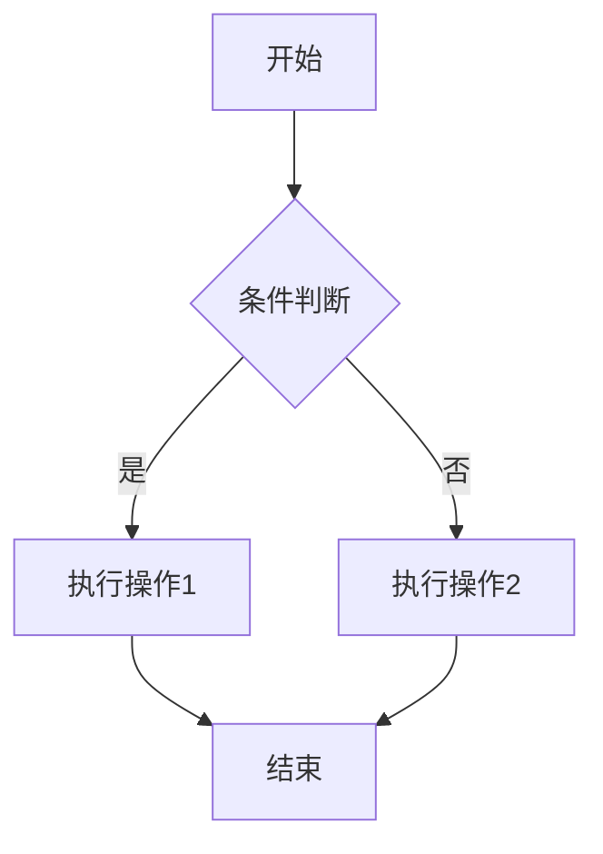

# <文档标题：简述需求内容>

> 模板：需求文档。复制后修改使用。
> frontmatter 的 `priority` 填需求优先级 `P0`–`P3`，各级判定口径以 [[frontmatter规范]] §1.3 为准（该处为唯一权威定义，本模板不重述）。

---

## 1. 背景

<!-- 为什么要提这个需求？来自哪里（客户反馈/产品规划/自驱）？ -->

## 2. 目标

<!-- 这个需求要达到什么效果？一句话说清楚。 -->

## 3. 范围边界

<!-- 明确本需求不做/不覆盖什么，防止范围蔓延。 -->
<!-- 示例：
- 不涉及 XXX 型号的适配
- 不改变现有 YYY 功能的交互逻辑
-->

## 4. 用户场景

<!-- 典型使用场景：谁、在什么条件下、做什么操作、期望什么结果。 -->
<!-- 系统级/底层功能无明确用户角色时，描述触发条件和设备行为即可 -->

## 5. 影响模块

<!-- 列出涉及的代码模块 -->
- `module_xxx`

## 6. 功能详情

<!-- 按功能点逐条描述：6.1 功能点1、6.2 功能点2...，数量按实际需求增减，不强制凑够多个 -->

### 6.1 <功能点名称>

<!-- 功能描述：做什么、怎么做、输入输出 -->

<!-- 涉及多步骤判断、状态流转、异常分支、多角色交互等逻辑时，可补充图表辅助理解；图表类型按内容选择，具体见 [[图表规范]]，非必须 -->

### 6.2 <功能点名称>

<!-- 结构同 6.1，按需增加更多功能点 -->

## 7. 参数

> ⚠️ 参数名必须使用统一标准叫法，不可同物异名。新参数先查术语表（[[术语表]]）确认命名，避免不同需求对同一参数用不同名字。

### 7.1 参数清单

| 参数名          | 值范围           | 默认值          | 备注            |
| ------------ | ------------- | ------------ | ------------- |
| <!-- 参数名 --> | <!-- 取值范围 --> | <!-- 默认值 --> | <!-- 关联说明 --> |

### 7.2 联动说明

<!-- 如果参数之间有联动关系（改 A 影响 B），在这里详细说明。没有联动可删本节 -->

### 7.3 参数异常处理

<!-- 参数异常时的处理方式：超范围怎么处理、缺省怎么处理、异常需要关注什么。如无特殊处理可删本节 -->

## 8. 依赖关系

<!-- 前置依赖：哪些需求/模块必须先完成本需求才能做 -->
<!-- 后置影响：本需求完成后会影响/解锁哪些需求 -->

- **前置依赖**：[[]]
- **后置影响**：[[]]

## 9. 设计依据（按需）

<!-- 设计选型的理由，为什么不用其他方案。有决策文档的链接：[[决策]] -->
<!-- 需求直白、无选型争议时本节可删 -->

## 10. 边界条件

<!-- 前置条件、限制范围、系统级异常情况。区别于 7.3「参数异常」，这里描述系统层面的边界 -->
<!-- 示例：
- 设备电量低于 20% 时不触发本功能
- 温度超过 85°C 时自动降级
-->

## 11. 风险

<!-- 实现中可能遇到的技术风险、兼容性风险 -->

## 12. 验收标准

<!-- 3-5 条可量化、可测试的验收条件。覆盖正常流程、异常流程、边界条件 -->
<!-- 嵌入式还需关注：功耗、时序、协议兼容、温漂等指标 -->

- [ ] <!-- 正常流程：... -->
- [ ] <!-- 异常流程：... -->
- [ ] <!-- 边界条件：... -->
- [ ] <!-- 性能指标（如适用）：功耗 ≤ xx mW、响应时延 ≤ xx ms -->
- [ ] <!-- 兼容性（如适用）：与 Vxx 协议版本兼容、OTA 升级后数据不丢失 -->

---

> **拆分颗粒度（建议，非强制）**：需求尽量拆到能独立验证的最小单元。
> 软件需求一般可拆到 1-2 天，但嵌入式需求常因硬件强耦合、不可中途交付（如电机校准、PID 调参需整体完成才能测）而无法硬拆到 1-2 天。
> 原则是"拆到能独立验证"，不强制卡时间。

---