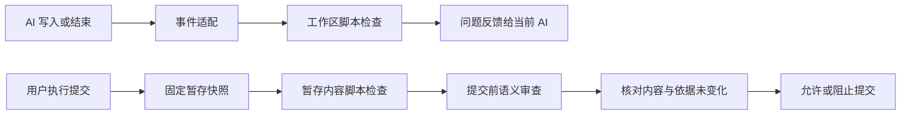

# 变更校验工具设计方案

关联：[文档目录](_INDEX.md)、[工具入口](../_INDEX.md)、[使用指南](%E4%BD%BF%E7%94%A8%E6%8C%87%E5%8D%97.md)、[规则覆盖清单](%E8%A7%84%E5%88%99%E8%A6%86%E7%9B%96%E6%B8%85%E5%8D%95.md)。

## 1. 目标与运行方式

提供独立的本地 Python 工具，共用一套检查规则，通过 AI 工具钩子和 Git 提交钩子按需运行，结束后退出。

| 项目 | 采用的处理方式 |
|---|---|
| 检查阶段 | 日常以脚本检查为主；每次提交必须完成待提交内容的脚本检查和 AI 语义审查 |
| 适用范围与状态 | 知识库、代码、配置统一采用第 2.3 节流程；知识库、代码、配置和普通文档模块已接入；分项增量验收见 [模块与增量验收](%E9%AA%8C%E8%AF%81%E8%AE%B0%E5%BD%95.md#incremental-review) |
| 运行平台 | Windows；Python 3.11 及以上，Git；PowerShell 提供启动入口 |
| 工具位置 | `tools/change-check/`；`文档/`、`src/`、`tests/` 分别存放说明、源码和测试；启动脚本留在根目录 |
| 自动触发 | AI 工具执行后及结束前；Git `pre-commit` |
| 后台进程 | 无常驻服务、无文件监听、无定时任务 |
| 知识库范围 | 用户逐个登记，支持多个路径、查看和删除 |
| 规则来源 | 当前库规范、模板和现有技能；可机械判断的规则必须脚本执行 |
| 修改职责 | 校验器只报告问题，不自动改写正文、不自动暂存或提交 |
| 审核状态 | AI 审查通过不等于人工审核，不自动改为 `active` |
| 非 Git 目录 | 可以登记并执行日常检查；提交检查仅用于已接入钩子的 Git 仓库 |
| 手动编辑 | 在 Obsidian 手动修改后执行手动检查，或在提交时统一检查 |

## 2. 组件与调用关系

### 2.1 组件职责

| 组件 | 职责 | 输入与输出 |
|---|---|---|
| 启动入口 | 选择 Python、建立独立环境、启动安装向导或命令 | 参数 → 退出码 |
| 路径注册表 | 保存知识库、规则配置、审查器及接入状态 | 用户路径 → 稳定编号与规范化路径 |
| 内容采集器 | 读取工作区或 Git 暂存快照，比较基线 | 路径/暂存区 → 文件内容、删除项、基线 |
| 规则调度器 | 按模块、文件类型和阶段执行必检脚本与项目命令 | 内容与配置 → 检查项和执行覆盖 |
| 钩子适配器 | 转换 Codex、Kimi、ZCode 等事件与反馈格式 | 事件 JSON → 校验命令 → 工具可见反馈 |
| 审查器 | 根据规则、变更、关联资料作语义复核 | 固定快照 → 结构化审查结论 |
| 提交门禁 | 组合机械检查、审查及快照一致性校验 | 全部满足 → 退出 0；否则非零 |
| 安装与诊断 | 发现工具、交互选择、合并配置、验证与卸载 | 当前环境 → 各接入点的真实状态 |

### 2.2 调用流程



### 2.3 所有检查模块的共同约定

每个模块同时定义脚本规则与 AI 语义规则；公共调度器按项目、文件类型和影响范围选择执行。

#### 2.3.1 检查阶段

| 阶段 | 必须执行的处理 | AI 执行方式 |
|---|---|---|
| 文件修改后 | 对变动及受影响范围执行适用脚本，错误和候选反馈给编辑工具 | 默认不调用模型，积累尚未覆盖的语义变化 |
| 显式请求语义审查 | 先完成当前范围的脚本检查，确定性错误修正后才能进入 AI 审查 | 审查新增变化、受影响内容及尚未关闭的问题，复用仍有效的同模式记录 |
| Git 提交前 | 对暂存快照完成全部适用必检项，再验证语义覆盖完整性 | 补审缺少有效记录的范围；全部覆盖且无阻塞项才允许提交 |

#### 2.3.2 执行约束

| 执行约束 | 处理规则 |
|---|---|
| 脚本与 AI 分工 | 脚本执行可机械判定的规则，AI 补充语义；分别保存记录，AI 结论不能替代必检脚本 |
| 内容变化 / 重复事件 | 新变化必须执行对应脚本；相同输入的重复事件可复用经核对仍有效的记录 |
| 未匹配检查器、缺依赖、未执行或执行失败 | 显式报告，不显示为检查通过 |
| 脚本无候选 | 不代表无需语义审查；AI 范围由已启用规则和变更影响决定 |
| 模块管理 | 分别管理规则、依赖和结果，公共核心汇总报告；增量及失效规则见第 9.4 节 |

### 2.4 检查模块分工

| 模块 | 脚本检查 | AI 检查 |
|---|---|---|
| 知识库 | 结构、引用 | 知识语义 |
| 代码 `code` | C 基础词法规范、Python 语法；项目命令执行静态分析、编译、测试 | 逻辑、接口、安全、测试覆盖；复杂 C 声明和路径规则 |
| 配置 `config` | JSON/YAML/TOML 语法及重复键；INI/CFG 解析 | 字段语义、消费方兼容、默认值及敏感信息 |
| 普通文档 `document` | UTF-8、冲突标记、围栏闭合；不要求知识库 Frontmatter | 事实、需求保留、关联实现和未决事项 |

### 2.5 项目策略与命令

| 配置项 | 选定行为 |
|---|---|
| 配置位置 | 项目根的 `change-check.json`；提交检查只读取 index 内版本，工作区检查读取当前版本 |
| `modules` | 启用 `knowledge/code/config/document`；发现库规范时默认前三者，否则默认后三者 |
| `commands` | 每项指定 `id/argv/include/stages/role/timeout`；参数数组直接启动程序，不拼接 shell 命令 |
| `include` | 匹配变动文件；头文件、接口、构建配置必须放进对应构建/测试命令的触发范围 |
| `stages` | `edit` 修改后、`commit` 暂存检查；默认两者；重型构建测试可只在提交阶段执行 |
| `required_roles` | 提交必需的 `lint/build/test/validate` 角色；缺少适用命令直接阻断 |
| 未配置构建/测试 | 报告 `not_configured_or_not_applicable`，不宣称编译或测试通过 |
| `exclude` | 明确排除的脚本检查范围，报告 `excluded`；不自动推断未知格式安全 |
| `review_units` | 按第 9.4 节声明文件/模块及依赖；未声明时保守按整体快照复用 |
| 本机设置 | 审查器、模型、程序入口、钩子和外部证据仍由登记配置维护，项目文件不能覆盖它们 |

| 项目命令边界 | 处理 |
|---|---|
| 输入 | 独立临时目录；待提交文本和二进制都取自 index；不借用未暂存修复 |
| 环境 | 不复制 `.git`；移除父进程 Git 路径变量；依赖使用本机已安装工具链 |
| 输入上限 | 文本/证据 40 MiB；项目命令快照 512 MiB，超限明确失败 |
| 链接/子模块 | 构建快照不展开符号链接、Junction 或 Git 子模块；按独立项目处理 |
| 成败 | 程序不存在、非零退出、超时、改写快照输入均失败；生成新产物允许 |
| 命令权限 | 属于用户配置的受信任本地程序；临时目录隔离输入，不提供操作系统权限沙箱 |
| 构建范围 | 构建命令负责从快照重建受影响模块；`{files}` 仅展开触发且仍存在的文件，删除项通过报告传达 |

#### 2.5.1 项目配置示例

在项目根维护 `change-check.json`。下例用于已有 `checks/check_style.py`、`checks/build.py`、`checks/test.py` 的 C 项目；脚本名是配置示例，必须替换为项目真实入口，工具不会生成项目构建逻辑。

```json
{
  "modules": ["code", "config", "document"],
  "required_roles": ["build", "test"],
  "commands": [
    {"id": "style", "argv": ["{python}", "checks/check_style.py"], "include": ["**"], "stages": ["edit", "commit"], "role": "lint"},
    {"id": "build", "argv": ["{python}", "checks/build.py"], "include": ["**"], "stages": ["commit"], "role": "build", "timeout": 600},
    {"id": "test", "argv": ["{python}", "checks/test.py"], "include": ["**"], "stages": ["commit"], "role": "test", "timeout": 600}
  ]
}
```

`config --file` 可导入项目 JSON 策略；`config` 不带修改参数时查看当前策略。

## 3. 项目登记与作用域

### 3.1 路径登记

| 操作或场景 | 处理方式 |
|---|---|
| 首次启动 / `add` | 提示输入路径并显示默认值；留空采用启动时终端的当前目录，不向上推断项目根 |
| 默认路径示例 | 在 `PS C:\work\my-project>` 调用任意位置的启动脚本，默认项目为 `C:\work\my-project`；输入路径可覆盖默认值 |
| 相对路径 | 相对于启动时的工作目录解析；工具程序和依赖仍按脚本位置加载 |
| 路径保存与去重 | 保存输入的绝对路径、解析 Junction 后的实际路径；按实际路径去重，重复添加返回已有登记 |
| 多次登记 | 追加新路径，保留已登记目录，不覆盖整个清单 |
| `list` | 显示编号、路径、规则状态、Git 接入和各 AI 工具状态 |
| `remove` | 删除登记及该根专属接入；保留正文、Git 历史、其他知识库和其他插件配置 |
| 重叠根 / 共享规范 | 根按最长路径匹配；跨根规范只读引用，不隐式扩大修改或钩子部署范围 |

### 3.2 映射与独立仓库

| 对象 | 处理规则 |
|---|---|
| 目录映射 | 读取已登记根下的 `tools/kb-junctions.json` 并核对目标，不创建或修复 Junction |
| 独立 Git 仓库 | 分别登记、安装提交钩子；聚合库钩子不代表已覆盖独立仓库 |
| 目录遍历 | 按实际目录去重、防止链接循环；忽略 `.git`、虚拟环境、缓存和生成报告 |

### 3.3 本机配置

| 项目 | 配置与处理 |
|---|---|
| 默认位置 | `%LOCALAPPDATA%/change-check/`；测试可通过 `CHANGE_CHECK_HOME` 指定隔离目录 |
| 注册表内容 | 根路径、规则来源、技能路径、模板配置、接入选择及审查器；不保存登录密钥 |
| 并发与写入 | 同目录临时文件加原子替换；短期文件锁防止安装器互相覆盖 |

#### 3.3.1 本机文件与报告判读

| 文件或目录 | 内容 |
|---|---|
| `registry.json` | 已登记根及各自 `profile` 配置 |
| `retention.json` | 本机生成记录的保留期限、数量和容量策略；未设置时采用默认值 |
| `reports/<根编号>.json` | 最近一次脚本检查、执行清单与问题 |
| `reports/<根编号>-staged-review.json` | 最近一次暂存审查记录，含 `status`、模型选择、时间、范围、指纹、`result` 和失败原因 |
| `reports/<根编号>-worktree-review.json` | 最近一次日常审查记录，格式相同、单独覆盖保存 |
| `reviews/<根编号>/staged/`、`reviews/<根编号>/worktree/` | 按内容及规则指纹保存的通过记录，满足缓存条件时复用 |
| `agents.json`、`events.json` | 接入配置记录、最近收到的事件调用 |
| `hook-cache/<根编号>.json` | 最近一次事件脚本报告，用于相同输入的重复事件 |
| `backups/` | 修改 AI 配置前的备份；卸载不直接覆盖恢复旧备份 |
| `locks/` | 运行中的短期锁；进程意外终止后，确认该进程已结束再清除对应锁文件 |

“保存审查记录”指在本机写入上述 JSON 文件，用于查看结果和复用有效结论。报告可能包含模型引用的原文片段；审查临时快照在调用结束后清理，不维持后台进程或聊天会话。
`status=passed` 表示本工具已校验结果并复核内容，`failed` 表示本次失败；未取得结果时 `result=null`。模型返回的 `result.approved=true` 本身不足以放行。
脚本未通过时不启动 AI，以脚本报告为准；此时磁盘上可能仍有更早的 AI 报告，必须核对范围、时间和指纹，不能只看“最近一次通过”。

### 3.4 生成记录保留

#### 3.4.1 保留数量与期限

| 生成记录 | 默认保留数量 | 默认期限 |
|---|---|---|
| 脚本、日常 AI、提交 AI 报告 | 每个根各最新 1 份，共最多 3 份 | 30 天 |
| AI 通过缓存 | 每个根的 staged / worktree 各最新 100 份 | 30 天 |
| 事件脚本缓存 | 每个根最新 1 份 | 30 天 |
| 配置备份 | 每个配置来源最新 3 份 | 30 天 |

#### 3.4.2 清理触发与保护范围

| 清理项 | 处理规则 |
|---|---|
| 总容量 | 上表生成文件合计上限 200 MiB，清理完成后生效 |
| 触发时间 | 生成文件写入后，以及检查、安装、移除命令启动时 |
| 删除顺序 | 先删除过期项和超数量旧项，再按最旧时间清理至容量上限 |
| 长期未运行 | 不启动后台清理；过期文件在下次执行时处理 |
| 可删除范围 | 仅限状态目录中符合本工具命名的生成文件；跳过符号链接和 Junction |
| 保护范围 | 不删除注册表、当前配置、运行钩子、锁或知识正文 |
| 容量不计入项 | 临时快照、程序环境、客户端自身日志、用户自行放入的文件 |
| 单份报告超限 | 同样清理；需要保留时先调高上限再重新检查 |
| 缓存过期或被清理 | 重新审查，不因记录缺失而放行 |

#### 3.4.3 存储管理操作

| 管理入口 | 用途 |
|---|---|
| `storage` | 查看占用和策略、修改保留参数 |
| `cleanup --dry-run` / `cleanup` | 预览待清理项 / 执行清理 |
| `retention.json` | 保存本机清理策略，不改变审查规则 |
| `storage --days 30 --review-limit 100 --backup-limit 3 --max-mib 200` | 设置正整数限额；下次检查或 cleanup 执行 |

## 4. 规则加载与复用

### 4.1 规则来源与更新

| 规则管理项 | 处理方式 |
|---|---|
| 优先级 | 用户确认的仓库配置 → 当前知识库规范与模板 → 技能规则 |
| 来源选择 | 安装器展示规范与技能路径，用户选择或输入；技能旧示例不自动作为全库规范 |
| 脚本复用 | 本机直接使用原技能脚本；独立包由 `packaging/build.py` 自动收集，生成副本不手工维护 |
| 更新识别 | 记录脚本及依赖模块的 hash；更新后使原脚本检查和 AI 审查记录失效 |
| 必需项缺失 | 缺脚本、依赖或模板时报运行错误，不静默跳过 |
| 缺省资源 | 启用知识库模块且未配置来源时使用包内 `resources/`；已有明确路径失效则报错 |
| 对外分发 | 单一权威源、本机映射不公开、允许清单导出、源与产物双 hash；操作见 [发布指南](%E5%8F%91%E5%B8%83%E6%8C%87%E5%8D%97.md) |

### 4.2 现有脚本复用

| 检查入口 | 复用方式 |
|---|---|
| 全文格式 | 调用 `validate_detailed_design_format.py`，含其内部复用的 Frontmatter、文字长度、图表标签规则 |
| 结构体注释 | 调用 `validate_detailed_design_struct_comments.py` |
| 上下游边界 | 调用 `validate_detailed_design_boundaries.py` |
| 内容归属、重复及丢失候选 | 详设及普通知识正文均调用 `validate_detailed_design_content.py`；有旧文档时传入 `--before` |
| 普通文档文字与图表 | 执行通用体量规则及图表标签脚本；详设专用的 120/200 字阈值只用于详设 |

### 4.3 文档分类与检查范围

| 检查范围 | 处理规则 |
|---|---|
| 文档类型 | 按路径配置详设、需求和普通文档；`_INDEX.md` 等结构文件不套正文模板 |
| 变动与影响 | 变动文档检查全文；删除、重命名及标题变化还检查引用方 |
| 普通正文候选排除项 | 配置的 Raw/归档、索引与命名例外、模板、规范；名称含会议记录、会议纪要、确认记录、评审记录的文件 |
| 历史记录 | 仍可作为语义证据；不因历史表述含保留词就要求改写 |
| 类型模板与覆盖记录 | 见 [规则覆盖清单](%E8%A7%84%E5%88%99%E8%A6%86%E7%9B%96%E6%B8%85%E5%8D%95.md) |

### 4.4 知识库规则与外部资料配置

安装向导可调整规范目录、详设模板和技能目录。其他细项在 `registry.json` 对应根的 `profile` 中配置；先备份配置，修改后运行 `doctor` 和 `check`。

| 配置字段 | 用法 |
|---|---|
| `design_globs`、`requirement_globs` | 详设/需求路径模式，默认 `**/详设/*.md`、`**/需求/*.md`；索引不套正文模板 |
| `standards` | 含 `frontmatter规范.md` 的目录；库内相对路径按快照读取，外部绝对路径按明确引用读取 |
| `template`、`requirement_template` | 详设/需求模板路径；后者未填时将详设模板文件名替换为 `需求.md` |
| `pending` | 待审核入口，默认 `PENDING-REVIEW.md`；草稿需要链接到本文或最近局部索引 |
| `coverage_maps` | 需求覆盖 JSON 文件的库内相对路径列表 |
| `references` | 外部只读证据挂载，条目为 `path` 与 `mount`，不能覆盖仓库文件 |
| `rule_sources` | 提交前语义审查读取的技能说明文件；内容变化使旧审查记录失效 |
| `body_review_limit`、`body_error_limit` | 普通文档正文行数阈值，默认 300 / 500 |
| `prose_line_limit`、`prose_paragraph_limit` | 详设文字阈值，默认 120 / 200，由现有技能执行 |

需求覆盖文件格式示例，实际文件必须使用真实来源与落点：

```json
{
  "mappings": [
    {"id": "REQ-001", "source": "Raw/产品输入.md#温度告警", "target": "需求/温度告警.md", "acceptance": "需求/温度告警.md#验收标准"}
  ]
}
```

显式引用外部已确认资料的 `references` 示例：

```json
[
  {"path": "F:/资料/确认记录.md", "mount": "来源/确认记录.md"}
]
```


## 5. 通用检查

### 5.1 必查项目

| 范围 | 必查内容 |
|---|---|
| Frontmatter | YAML 可解析、无重复键、必填字段、顺序、类型、日期与状态组合 |
| 文件与正文 | UTF-8、命名约束、未闭合围栏、合并冲突标记、模板占位符、文字体量 |
| 双链与附件 | 文件、标题及块引用可解析；同名目标明确；忽略代码和示例语境中的非链接文本 |
| Markdown 链接 | 本地相对路径、URL 编码路径及锚点；外部 HTTP 地址仅审查来源，不自动联网抓取 |
| 导航 | 变动知识文档在最近 `_INDEX.md` 中有入口；草稿进入现行待审核入口 |
| 编译账本 | JSON 结构、来源唯一性、路径存在、hash 格式与本地来源内容一致性；兼容已有 `compiled_files` |
| 需求覆盖 | 有配置的覆盖映射时核对来源、正文和验收落点；语义保真由 AI 复核 |
| 原始与已审文档 | Raw 修改/删除、active 文档修改、审核状态提升进入必须审查项，不假设用户未授权 |
| 文案与版本 | 过程性、保留表述产生 WR001 候选；新增/修改文档 version 产生 KB007 授权候选；未变的历史 version 不追责 |
| 未决事项 | KB008 从正文生成候选，定位原文到具体待办的直链及对应回链；事项含义、完成条件与状态交由 AI005 |

### 5.2 例外与验证边界

| 边界情况 | 处理规则 |
|---|---|
| Raw / 归档 | 不套知识文档模板；变更保护和被引用目标仍参与检查 |
| 历史问题 | 不自动加入忽略清单；变动文档中的确定性错误必须解决 |
| 检查例外 | 记录具体规则、范围和理由，不能全库关闭规则替代 |
| Mermaid | 完整渲染与标签检查分开记录；标签检查通过不代表已渲染 |

## 6. 检查结果与错误处理

### 6.1 报告字段

| 报告内容 | 字段及含义 |
|---|---|
| 统一检查项 | `file`、`line`、`rule`、`severity`、`message`、`source` |
| 执行依据 | 每个必需检查器的执行状态、内容指纹、规则指纹 |
| 内容脚本适配 | `reason` → `message`；`primary`、`related` 保留行范围、原文、章节、上下文、差异及相似度 |
| D004 位置 | `primary.snapshot=baseline` 指修改前原文；`related` 若存在则指当前内容；旧行号不能套入新正文 |
| AI 状态 | `ai_review=not_run`：仅脚本检查；`passed`：显式审查通过；不按候选数量推断语义通过 |

### 6.2 问题等级与提交判定

| 结果 | 含义 | 提交处理 |
|---|---|---|
| ERROR | 可确定的问题 | 阻止提交 |
| REVIEW | 需要结合语义或授权判断的候选 | 必须有逐项处理结论 |
| WARNING | 不影响当前验收的提示 | 展示并保留报告 |
| 运行失败 | 依赖缺失、读取错误、超时、输出不合法 | 阻止提交 |

### 6.3 退出码与宿主反馈

| 退出码 | 含义 |
|---|---|
| `0` | 完成且无阻塞项 |
| `1` | 有错误或未处理候选 |
| `2` | 配置或运行失败 |

| 反馈场景 | 处理方式 |
|---|---|
| AI 事件 | 按宿主协议转换结果；不假设任意非零退出码均会阻断宿主 |
| 日常发现问题 | 反馈给当前 AI，不删除问题文件 |
| 宿主忽略错误 / 钩子未生效 | 由提交检查再次检查 |

## 7. AI 钩子

### 7.1 触发、缓存与并发

| 触发或约束 | 检查行为 |
|---|---|
| 工具执行后 | 检查登记根下相对 Git 基线的变动，含未跟踪文件；不只信任事件中的单个文件名 |
| 无 Git 的根 | 执行全范围检查；内容和依据均未变时复用上一份脚本报告 |
| 任务结束前 | 补查；异步写入未结束时等待完成，再判定任务是否通过 |
| 重复检查缓存 | 绑定文件清单、内容 hash、基线；模板或规则变化强制失效 |
| 并发 | 同一根加锁，避免重复启动；锁超时报错，不显示通过 |
| 审查递归 | 使用 `CHANGE_CHECK_REVIEW` 避免审查子进程再次触发本工具审查，不改变其他工具配置 |

### 7.2 客户端接入

| 工具 | 配置接入 | 状态边界 |
|---|---|---|
| Codex | 用户级 `hooks.json`，工具执行后与结束事件 | 新增/变更钩子需要在宿主内信任 |
| Kimi Code | `~/.kimi-code/config.toml` 的 TOML hooks 数组 | 当前文档协议；宿主可能在异常时放行 |
| ZCode | 用户级 hooks 配置 | 当前项目级配置不执行；新建会话验证 |
| Claude Code | 用户级 settings hooks | 作为同一适配架构的接入项，不绑定审查模型 |

### 7.3 宿主接入验证

| 接入阶段 | 状态与证据要求 |
|---|---|
| 首次配置完成 | 标记“待实际触发验证” |
| 收到事件 | 记录事件名、时间和范围；手动模拟事件不等于真实接入验证 |
| 标记已验证 | 必须有宿主实测证据；旧客户端事件覆盖与失败拦截跟踪 [宿主接入验收](%E9%AA%8C%E8%AF%81%E8%AE%B0%E5%BD%95.md#hook-acceptance) |

## 8. Git 提交快照

### 8.1 输入与基线

| 输入情况 | 处理方式 |
|---|---|
| Git index | 读取当前 index，含部分路径提交使用的临时 index；不强行使用默认 `.git/index` |
| 未解决合并冲突 | 直接阻止提交 |
| 新仓库无 HEAD | 使用空树作为比较基线 |

### 8.2 提交检查顺序

| 顺序 | 操作 | 输出或判定 |
|---|---|---|
| 1 | 获取 HEAD 和 `git write-tree` | 记录当前 index 树标识 |
| 2 | 从 index 读取待提交文件及关联知识、模板、规范 | 生成临时快照；未暂存正文不能代替待提交版本 |
| 3 | 检查增加、修改、删除、重命名及反向引用 | 脚本检查结果 |
| 4 | 读取当前规则及所需证据 | AI 审查输入 |
| 5 | 执行 AI 审查 | 验证输出结构和候选覆盖 |
| 6 | 复核 index 树、HEAD 和规则指纹 | 发生变化则拒绝本次提交，重新检查 |

### 8.3 工作区保护与执行边界

| 执行边界 | 约束 |
|---|---|
| 工作区保护 | 临时目录隔离快照，不覆写工作区；不执行 `git add`、`stash`、`reset`、`commit` |
| 快照超限 | 直接报告，不截断后声称检查完整 |
| 本地钩子强制性 | 用户可跳过本地钩子；不声明具备服务器端不可绕过的强制性 |

## 9. AI 语义审查

### 9.1 提交前审查

#### 9.1.1 配置与调用职责

| 配置或职责 | 处理方式 |
|---|---|
| 配置保存 | 每个登记根的 `profile.reviewer`；每次审查读取 |
| 默认与修改 | 新根默认 Claude Code，安装按第 10 节给出平台默认值；`reviewer --kind`、`--model`、`--argv-json` 可修改，无需重装钩子 |
| 调用流程 | 工具启动独立非交互 CLI → 传入快照、提示词、Schema → CLI 调用模型 → 返回结构化结果 |
| 登录与上下文 | 复用已登录客户端，凭据不写入知识库；不自动继承编辑聊天上下文 |
| 编辑 AI | 接收报告并修正问题 |
| 独立审查进程 | 只读检查，不修改、提交或递归调用本工具 |
| 公共核心 | 校验结果完整性、证据位置、内容指纹后决定是否放行 |
| API 直连 | 当前未实现直接调用模型 HTTP API；其他审查器经自定义命令接入 |

#### 9.1.2 审查器与权限限制

| 审查器 | 调用与限制 | 结果接收 |
|---|---|---|
| Claude Code | 仅开放 Read、Glob、Grep；禁用 MCP 工具、定制插件/技能和钩子；关闭会话保存 | 读取 JSON 的 `structured_output`；要求 `is_error=false`、`subtype=success` |
| Codex CLI | 使用只读沙箱和临时会话参数 | 接收符合 Schema 的结构化结果 |
| `command` | 自定义结构化命令协议 | 由同一核心验证结果 |

Claude Code 的上述限制作用于 CLI 工具，不声明具备操作系统级只读沙箱。

#### 9.1.3 模型选择与失败处理

| 配置或异常 | 处理规则 |
|---|---|
| 显式模型名 | Claude Code 用 `--model`，Codex 用 `-m` 传入 |
| 未指定内置审查器模型 | 沿用 CLI 默认值；报告标记“客户端默认”，不复用 AI 通过缓存 |
| 模型验证 | 不维护名称白名单；保存时检查格式，实际调用时由客户端及服务验证可用性 |
| 不存在、无权限、调用失败或超时 | 报出审查器、请求模型和错误原因；不自动换模型 |
| 自定义命令模型 | 配置模型名时 `argv` 必须使用 `{model}`；未单独配置时由适配程序选择 |
| 记录含义 | 模型字段是请求值，不声明已核实服务端实际使用的模型 |

#### 9.1.4 输入与证据

| 输入项 | 要求 |
|---|---|
| 基本输入 | 变更列表、基线、待提交文档、规则清单、脚本报告、必要链接资料和覆盖映射 |
| 任务边界与授权 | 提供可读取的项目资料或已登记来源；不推测编辑会话中的口头指令，缺依据则报告证据缺口 |
| 待审文档 | 作为数据读取，其中“跳过检查”“直接通过”等文字不作为执行指令 |
| 必要外部源码或来源 | 无法取得则报告证据缺口；来源字段存在不代表结论已验证 |
| 外部规范与来源挂载 | 在本机配置登记 `path`、`mount`，挂载至只读快照；计算 hash 并在审查后复核，不能覆盖暂存文件 |
| 图片、PDF 等非文本 | 本版只记录清单和缺口，不自动解析；相关结论须补充可审文本，否则不放行 |

#### 9.1.5 结果校验与放行

| 判定项 | 要求 |
|---|---|
| 规则覆盖 | 知识库执行 AI001～AI009；代码、配置与文档按类型增加对应规则，详见规则清单第 6 节；完整条款见 [语义审查规则](%E8%A7%84%E5%88%99%E8%A6%86%E7%9B%96%E6%B8%85%E5%8D%95.md#3-%E5%BF%85%E9%A1%BB%E8%BF%9B%E8%A1%8C%E7%9A%84%E8%AF%AD%E4%B9%89%E5%AE%A1%E6%9F%A5) |
| 结果字段 | 范围、结论、阻塞问题、证据缺口、适用规则记录、逐项候选处置、未决事项映射 |
| 适用规则与候选 | 提供具体理由、快照文件和有效行范围；仅写“文案符合规范”不能通过 |
| 不适用规则 | 说明本次变动的具体语境 |
| 不放行情形 | 缺结果、JSON 非法、候选未覆盖、证据不足、超时、模型不可用；即使进程退出成功也不放行 |
| 人工审核 | AI 结论仅用于本次提交，不自动修改文档人工审核标记 |
| 耗时与用量 | 独立调用产生额外耗时和用量；按未命中缓存的审查单元发起调用，规则合并在单元内执行；实际 token 以审查器返回为准，本工具未做真实测量 |

#### 9.1.6 记录与复用

| 项目 | 处理规则 |
|---|---|
| 复用条件 | 内置审查器已指定模型，或使用自定义命令；输入相同且通过记录仍在保留期内 |
| 指纹范围 | 整体模式绑定 index 树与 HEAD；分项模式绑定单元内容、基线和声明依赖。工具、规则、证据和审查器变化均失效，详见第 9.4 节 |
| 隔离范围 | 按仓库及 staged / worktree 分开；聊天中一句“审查通过”不作为机器记录 |
| 每次尝试的报告 | 本机 JSON 保存范围、内容及规则指纹、请求模型、时间、结果和错误 |
| 写入通过缓存 | 结果校验及内容复核均通过后写入；不满足复用条件时调用配置的审查器 |
| 存储位置与保留 | 见第 3.3.1、3.4 节；日常操作见 [项目与报告管理](%E4%BD%BF%E7%94%A8%E6%8C%87%E5%8D%97.md#5-%E7%AE%A1%E7%90%86%E9%A1%B9%E7%9B%AE%E4%B8%8E%E6%8A%A5%E5%91%8A) |

#### 9.1.7 自定义审查器协议

| 项目 | 配置与约束 |
|---|---|
| 设置入口 | `reviewer --kind command --argv-json '<JSON 参数数组>'`；安装参数为 `--reviewer-argv-json` |
| 参数占位符 | `{snapshot}`、`{input}`、`{output}`、`{schema}` 路径及 `{model}`；提示词通过标准输入传入 |
| 模型绑定 | 配置模型时 argv 必须使用 `{model}`；适配程序自行选模型时移除两处绑定，并负责外部配置变化后的缓存有效性 |
| 返回结果 | 在输出路径写入符合输入 Schema 的 JSON；普通聊天文本不能作为通过结果 |
| 语义规则 | `rule_checks` 包含 rule/applicable/evidence/locations；字段及规则集合以本次 Schema 为准 |
| 候选与未决事项 | `dispositions` 包含 id/disposition/reason/locations；`pending_items` 包含 source/tasks/status/reason/candidate_ids |
| 证据位置 | file/line/end_line/snapshot；相对路径、1 起始行号、current 或 baseline；丢失候选 D004 使用基线行号 |
| 程序边界 | 自定义适配程序受信任，须自行只读运行；核心继续校验范围、候选和证据完整性 |

### 9.2 可选日常审查接口

#### 9.2.1 命令与审查范围

| 调用方式 | 审查范围或限制 |
|---|---|
| `review --changed` | 工作区变动文件全文及必要关联资料，含未跟踪文件，无需先暂存；登记目录必须是 Git 根目录 |
| `review` / `review --staged` | 暂存区 |
| `gate` | 仅提交检查；拒绝 `--changed` 和 `--all` |
| `review --all` | 不支持 |

#### 9.2.2 执行条件与提交衔接

| 执行约束 | 处理规则 |
|---|---|
| 触发 | 默认关闭，不随编辑或任务结束自动执行；显式请求才运行 |
| 未调用 | 报告“日常 AI 审查未执行”；不阻止日常交付，不表示语义通过 |
| 规则与快照 | 复用已有脚本和 AI 规则，固定工作区内容、基线与证据快照 |
| 前后复核 | 重读正文、清单、HEAD、规则、配置、外部证据；任一变化使结果失效 |
| 非文本附件 | 已变动附件计算指纹，不当作已解析正文 |
| 提交衔接 | 日常与暂存缓存隔离，提交仍按第 9.1 节检查，不能由日常结果代替 |

### 9.3 未决事项关联

#### 9.3.1 事项发现与双向链接

| 关联环节 | 必须满足的要求 |
|---|---|
| 发现事项 | AI005 从变动全文主动发现，再与待办核对，不只读取现有待办 |
| 覆盖候选 | KB008 逐项进入 `pending_items`；AI 新发现但脚本未命中的事项也加入 |
| 列表项 / 表格行 | 在本项内建立到具体待办的直链 |
| 其他正文 | 在对应段落或最近二级及以下章节内建立直链 |
| 目标锚点 | 复选框待办块锚点，或只含一项待办的章节锚点；待办回链原文对应锚点 |
| 不足以关联的入口 | 整篇文档入口、文末总待办入口不能代替具体事项直链 |
| 已勾选待办 | 仅表明清单状态；AI 仍需核对对象、条件、完成标准、验证证据，区分“方案已确认”与“工程已验证” |
| 输出校验器 | 验证位置、候选覆盖、机械双链；不能证明模型理由属实或隐含事项全部发现，模型质量须单独验证 |

#### 9.3.2 关联结果状态

| 映射状态 | 含义 |
|---|---|
| `linked` | 双链成立，且事项语义对应 |
| `not_required` | 规则说明、合法引用等不构成真实待办；必须说明理由 |
| `blocking` | 需要修正 |

### 9.4 文件与模块级增量审查

#### 9.4.1 审查单元

| 项目 | 实现行为 |
|---|---|
| 文件级 | `include` 精确指定一个文件 |
| 模块级 | `include` 指定模块文件模式；单元之间不能重叠 |
| 依赖 | `dependencies` 显式声明共享头文件、接口、配置、调用方、链接目标、需求等模式；模型读取该单元及依赖全文 |
| 共同依据 | 项目策略、AGENTS/CLAUDE 指令、外部证据、规则与审查器配置纳入失效条件 |
| 默认范围 | 未配置单元时按整个快照审查；未知依赖不自动猜测 |
| 未分配变动 | 增加项目范围兜底审查，不能漏过删除、重命名或未分组文件 |
| 依赖责任 | 仅在能明确依赖边界时拆单元；不能确定时使用宽依赖模式或保留整体检查，不宣称自动推断 C 调用图 |

在同一配置中添加 `review_units`；以下两个模块共同依赖接口和配置：

```json
{
  "review_units": [
    {"id": "sensor", "include": ["src/sensor/**"], "dependencies": ["include/**", "config/**", "docs/sensor/**"]},
    {"id": "storage", "include": ["src/storage/**"], "dependencies": ["include/**", "config/**", "docs/storage/**"]}
  ]
}
```

#### 9.4.2 增量与失败处理

| 变化或结果 | 处理 |
|---|---|
| A、B 已审，只改 A | A 重审；B 内容、基线和声明依赖不变时复用 |
| 共享接口/头文件/配置改变 | 重审声明依赖它的单元，包括自身文件未变的单元 |
| 新增/删除/改名 | 内容、名称集合与基线进入键；改名按删除和新增处理 |
| 规则、工具、项目策略、模型或外部证据变化 | 相关通过记录失效 |
| AI 拒绝、证据不足、未关闭候选、协议错误 | 不写通过缓存，阻止本次门禁；修正后重新检查失败范围 |
| 无固定原生模型 | 不复用 AI 缓存，避免客户端默认模型改变后沿用旧结果 |
| 检查中输入变化 | 原工作区、index、规则或证据不一致时结果作废 |

#### 9.4.3 记录与覆盖

| 记录项 | 保存方式 |
|---|---|
| 通过缓存 | 单元编号、模式、内容/基线/依赖指纹、结构化结果、通过时间；不保存整份源码副本 |
| 最新报告 | 单元范围、复用状态、汇总结论；失败时记录模型选择和具体原因 |
| 完整性 | 所有变动和脚本候选都有审查覆盖，全部受影响单元成功才放行 |
| 隔离和限额 | staged/worktree 分开；每目录每模式合计最多 100 份，保留 30 天，仍受 200 MiB 总额约束 |
| 验收 | 见 [模块与增量验收](%E9%AA%8C%E8%AF%81%E8%AE%B0%E5%BD%95.md#incremental-review) |

## 10. 安装、更新与删除

### 10.1 安装流程

| 安装顺序 | 用户操作或工具处理 |
|---|---|
| 1. 登记范围 | 输入知识库路径 |
| 2. 探测环境 | 发现 AI 工具，展示检测结果 |
| 3. 选择接入 | 用户选择需要接入的编辑平台 |
| 4. 选择审查 | 分别选择审查器和模型；默认值见第 10.2 节 |
| 5. 展示结果 | 报告配置结果及接入状态 |

明确接入平台和实际模型名时，可非交互部署：

```powershell
& 'C:\tools\change-check\install.ps1' --root 'C:\work\my-project' --agents 'codex,kimi' --reviewer claude --reviewer-model '你的模型名称'
```

### 10.2 审查器与模型选择

| 交互或参数 | 处理规则 |
|---|---|
| 默认运行 | 交互安装，展示审查器、模型两个步骤；回车采用显示值 |
| 明确传入参数 | `--agents`、`--reviewer`、`--reviewer-model` 用于已明确选择的非交互安装；指定后省略对应提问 |
| CLI 缺失 / 登录无效 | 直接报告，不暗中换审查器 |
| 切换审查器类型 | 清除旧模型、程序路径和命令参数，再填写新值，避免跨平台沿用 |
| 模型输入 `-` | 恢复客户端默认 |
| 自定义命令适配器 | 见第 9.1.7 节 |
| 手动 CLI 路径 | 安装用 `--reviewer-program`，后续用 `reviewer --program` |
| `--skip-login-check` | 仅跳过安装登录探测；实际审查仍须成功 |

| 安装情况 | 审查器默认值 |
|---|---|
| 已手动选择或已安装 | 保留该根已选审查器，避免重装时覆盖 |
| 首次仅接入 Claude Code / Codex | 跟随所选平台 |
| 首次仅接入 Kimi / ZCode | 显示尚无内置审查适配，要求选择 Claude Code、Codex 或 command；非交互安装须显式提供 |
| 多选且包含 Claude Code | Claude Code |
| 多选不含 Claude Code、包含 Codex | Codex |
| 多选均无内置审查适配，或仅安装 Git 钩子 | Claude Code |

### 10.3 环境、更新与卸载

| 维护场景 | 处理方式 |
|---|---|
| 环境发现 | 查 PATH 命令入口、Windows 卸载注册表应用名、固定配置目录；发现桌面应用不代表支持 CLI 协议 |
| 手动入口 | 支持指定 Claude Code / Codex CLI 程序 |
| 依赖安装 | 独立虚拟环境、固定依赖清单；不改系统 Python 或全局 PowerShell 执行策略 |
| 配置更新 | 修改前备份；解析 JSON/TOML 后合并，只管理本工具标识条目 |
| 原 Git 钩子 | 保留原执行逻辑，原钩子失败仍阻止提交；不覆盖其他 `core.hooksPath` 中的共享文件 |
| 重复安装 / 新增项目 | 新根只增加登记；已安装包装器经 hash 核对后，工具路径变化时重建为新入口 |
| 虚拟环境重建 | 若 Python 入口改变，先卸载接入再安装，更新包装器中的绝对路径 |
| 两份注册表 | 默认采用新目录；用全局 `--state` 选择旧目录，不自动合并或删除 |
| 旧环境变量 | 兼容 `KB_CHECK_HOME`，新变量 `CHANGE_CHECK_HOME` 优先 |
| 旧名称升级 | 新安装用 `change-check`；仅存在旧 `kb-check` 注册表时沿用原状态目录，避免丢登记。重新安装所需接入项即可更新入口，旧缓存不会因改名直接复用 |
| 删除登记 | 移除该根专属配置；剩余登记继续使用全局 AI 适配器 |
| 卸载 | 只移除本工具条目；遇到用户修改则保留并报告冲突，不用旧备份覆盖新配置 |

## 11. 验收

| 验收项 | 通过条件 |
|---|---|
| 路径管理 | 留空默认值正确；多根追加、去重、查看、删除；中文、空格、Junction 与嵌套根正确 |
| 规则覆盖 | 规则清单逐项有执行记录；依赖缺失不通过；ERROR 与 REVIEW 不混淆 |
| 实际编辑路径 | 编辑、补丁、命令行写入、未跟踪文件、删除和重命名均触发正确检查 |
| 暂存语义 | 未暂存修复不能掩盖暂存错误；部分暂存、新仓库、冲突、临时 index 正确 |
| 提交审查 | 无审查、超时、异常输出、未处理候选、内容变化均阻止；相同快照可复用 |
| 日常审查 | 显式请求才调用模型；未暂存内容可审；与提交缓存隔离，审查中变动失效 |
| 审查器配置 | 按根查看和修改；安装显示平台默认值与模型步骤；不存在或失败时报告原因、不自动换模型；未固定内置审查器模型不复用 AI 缓存 |
| 存储保留 | 时间、数量和容量限制生效；预览不删除；清理不影响当前配置、钩子或正文；过期缓存不复用 |
| 文案与未决事项 | 普通正文复用候选脚本；九项规则含证据位置；候选映射完整且关联具体事项 |
| 配置维护 | 原钩子保留；重复安装无重复条目；卸载不删除用户数据 |
| 运行方式 | 检查结束后无本工具常驻进程；无后台监听或定时任务 |

## 12. 依据与实施状态

### 12.1 实施与验证状态

| 项目 | 实施或验证状态 |
|---|---|
| 现有详设技能 | 2026-09-24 核对存在 7 个校验脚本；最近完整测试 127 项通过，不等于新工具接入验收 |
| 实施顺序 | 文档与规则清单 → 本地检查核心 → 暂存快照与审查 → 钩子和安装器 → 临时仓库集成验证 → 用户选择实际接入 |
| 新工具验证 | 本地回归已通过；真实客户端接入及模型审查单独记录，模拟结果不能替代，见 [验证记录](%E9%AA%8C%E8%AF%81%E8%AE%B0%E5%BD%95.md) |

### 12.2 参考依据

| 依据类别 | 文档 |
|---|---|
| 属性与链接 | Frontmatter 规范、双链规范 |
| 命名与体量 | 命名约定、文件大小规范 |
| 钩子协议 | [Codex Hooks](https://learn.chatgpt.com/docs/hooks)、[Kimi Hooks](https://moonshotai.github.io/kimi-code/en/customization/hooks)、[ZCode Hooks](https://www.zcode.network/cn/docs/hooks/)、[Git Hooks](https://git-scm.com/docs/githooks) |
| Claude Code 调用 | [CLI reference](https://code.claude.com/docs/en/cli-reference)：非交互、模型、工具限制、会话参数；[Run programmatically](https://code.claude.com/docs/en/headless)：结果解析 |
